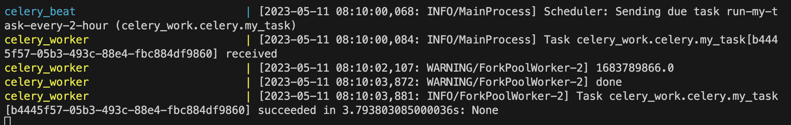

# Stock Sentiment Analysis with Reddit 

## I. Introduction
There has been a gigantic inflow of retail investors after the outbreak of COVID-19 pandemic and FED continuing dovish policies. The market continued a massive bull rally, and stocks gained as if they would never come back. The public's interest in stocks skyrocketed, which led r/stocks, a financial subreddit, gain over 11x times its subscribers before the pandemic(460k in Jan 2020, 5.1M in Jan 2023). Active discussion and company analysis happen in the giant financial community. 

This project, built using Flask framework, aims to help retail investors including myself :\), interested in knowing perspective of many retail investors, by process and filter out the subreddit's posts data and provide multiple useful index including top 25 most mentioned stocks and its performance compared 3 majors US index(Dow, S&P 500, Nasdaq), subreddit sentiment analysis following concepts of CNN's fear and greed index, and filtered high quality research and analysis posts.

## II. Data Collecting, Methods, Anlaysis 

### API 
I initially used Pushshift API to extract posts data from r/stocks. However, on May 2nd, 2023, developers of the API decided to shut it down. So I had to restructure all my code from using Pushshift API to praw API. Using praw, I extracted each post's title, selftext, created_utc, link_flair_text, url, score.

Also, I used yfinance API to to gather in-depth financial data including daily highest, lowest, closed price, and performance compared to 3 majors index. 

### Data Filtering/Processing
After receiving post data from praw, I applied 'cleaning' function on selftext and title, which used regular expression to filter out stopwords downloaded from NLTK python package, hyperlinks, and unnecessarily repeated words. This is done to reduce time complexity. Then, I tokenized the filtered selftext and counted stocks names or tickers and their mentioned number and used pandas to organize and analyze the data. 

  
   

### Database 
I used MongoDB Cloud to store the processed post data. All the documents are within 2 years, and they are updated with celery asynchronously. Under 'posts_database', there are 2 collections: 'post_collection', with fields of _id, created_utc, mentioned_num, sentiment, stocks_mentioned and 'post_rank_collection', with fields of _id, link_flair_text, score, created_utc, url, title. Under 'post_collection', there are over 25,000 documents, 2 years worth of filtered post data. Under 'post_rank_collection', there are around 700 documents, high quality filtered posts in recent 2 years.  

Initially, I stored unfiltered selftext and title. However, that would require above free cluster tier(M0). As I had $0 for my budget, I decided to reduce memory by storing only filtered result, which are a list of stocks mentioned, their mentioned numbers, and a post's sentiment ratio. By doing so, it increased the run time and saved sufficient memory to stay on free tier cluster(M0). 

### Background task
The data updating process is done as a background task through celery, which use redis as backend and broker. It asynchronously does the task to give most up to date accurate data for users. By using celery beat, it is scheduled to do data collecting process every 4 hours. 

    
    

### Demonstration and Analysis

A user inputs start date and end date which have to be in the range of two years. 

    
    

In this example, I inserted March 05, 2023 as start date and March 27, 2023 as end date. As shown in image, there is a top 25 most mentioned stocks and there performance. Also, a list of filtered worth reading posts. 

Head of the result page shows 3 index performance over the period, and interestingly, according to sentimental analysis, retail investors in r/stocks are at extreme fear stage. It makes sense considering the fact that silicon valley bank collapsed and brought a huge chaos in the market. 

Regarding the sentimental analysis, I collect documents matching the time range from MongoDB cloud and count the number of negative/positive words (check Citation for negative/positive words list). Then, find a proportion; there are 5 sentimental stages: Extreme Greed, Greed, Neutral, Fear, Extreme Fear. An interesting fact is that as I was simulating it, posts tend to be more negative(possibly due to anonymity, one finds easier to protray her negative view). 

## III. Docker and AWS
I used docker to containerize my application for the purpose of reducing complexity of running the project and deploying my containerized application to AWS. For local usage, I chose docker-compose to orchestrate 3 containers(flask_app, celery_work, redis) on my laptop with just one command 'docker-compose up'. It really helped me test current version of the project and figure out which container has an issue by looking at its logs. 

After I completed working on the project locally, I deployed it to AWS ECS with Fargate. I made an attempt to use ECS with EC2, as it has free tier option. However, I continued to receive an error message that my application required more than 1vCPU with t2.micro, so I decided to use Fargate, instead. I initially uploaded my project images to my private repository in ECR. Then, I created a task definition with IAM to allow permission to pull images from ECR. I used separate security groups and load balancer to control the traffic, preventing potential error or slowdown. After creating a new cluster, I created service and task. It successfully ran. 

I opened my application with the public IP that it provided, and it worked the same as in my computer. 

    
    

## IV. Result and Self-Reflection and Suggestions
I used my application to do simple historical back test: type in the time range when S&P 500 index decreased over 5% within a month, and the sentiment index, most of the time, reflected reasonably high accuracy. However, due to the limit of free tier MongoDB cluster(100 operations per second and limited data storage), the application only analyzed at maximum 2 years worth of post data, and it might cause bias as stock performance during COVID era was phenomenally greater than the past. 
In addition, it comes down to an obvious point that when stock prices increase/decrease, people become more positive/negative, which results in writing posts with positive/negative connotations. 

However, even with the drawbacks, I believe that the project is useful to get a sense of general atmosphere of 6 million retail investors and stocks that are on their radar. Also, it summarizes hot discussion and detailed company analysis that are worth viewing. 

## V. Conclusion and My Thoughts
It was a really interesting and tough journey to complete this project. I started working on the project for my pure curiosity and interest in stocks and reddit as a social platform while I was on holiday during my military service. As an undergraduate student, it was really rich experience to learn new technological skill that are not normally taught in college to accomplish my goal and fulfill my desire to learn. 

## Contributors
Hwanhee Kim(voiucee@gmail.com)

## Citation
Minqing Hu and Bing Liu. "Mining and Summarizing Customer Reviews." 
    Proceedings of the ACM SIGKDD International Conference on Knowledge 
    Discovery and Data Mining (KDD-2004), Aug 22-25, 2004, Seattle, 
    Washington, USA, 

